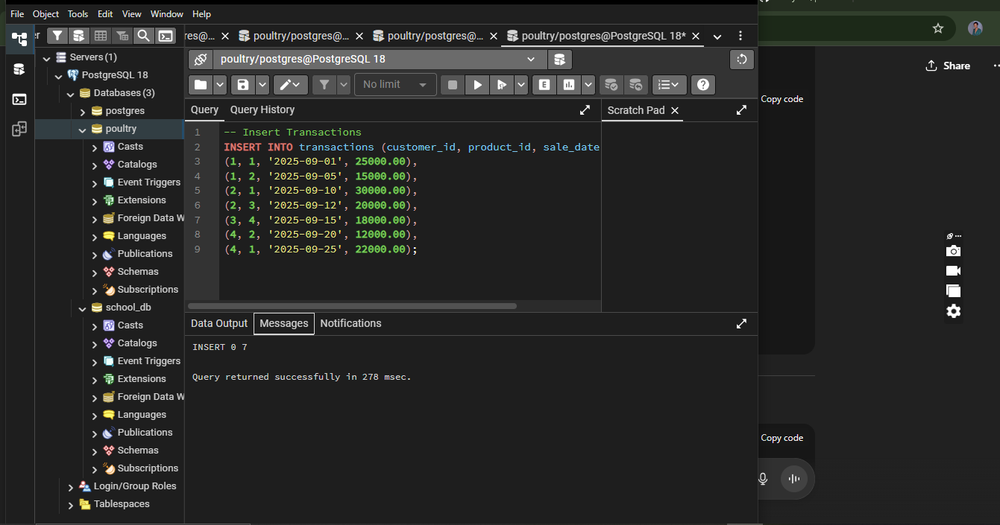

# Docile's poultry -PL/SQL Window Functions Assignment
**NAMES:**UWIZEYE DOCILE
**ID:**27549
**COURSE:**PL/SQL
**Department:**Software Engineering
# Docile's Poultry – Window Functions Project

## Table of Contents
- [Problem Definition](#problem-definition)
- [Success Criteria](#success-criteria)
- [Database Schema](#database-schema)
- [Window Functions Implementation](#window-functions-implementation)
- [Results Analysis](#results-analysis)
- [References](#references)

## Step 1: Problem Definition (2 pts)

**Business Context**  
Docile’s Poultry is a small-to-medium poultry business that sells fresh and packaged chicken meat (whole chicken, wings, drumsticks, fillets) to households, supermarkets, and restaurants in Rwanda. The company operates in the food and agribusiness industry with a mix of wholesale and retail customers.  

**Data Challenge**  
The business struggles to identify which chicken products sell best in different regions, track sales trends over time, and understand customer spending behavior. Without these insights, inventory management, marketing, and financial forecasting are inefficient.  

**Expected Outcome**  
- Identify **top 5 chicken products per region and quarter**.  
- Monitor **running monthly sales totals**.  
- Calculate **month-over-month growth** in revenue.  
- Segment customers into **quartiles (low spenders vs. high spenders)**.  
- Detect **seasonal sales patterns** using 3-month moving averages.  

## step 2: Success Criteria (2 pts)

1. Find **Top 5 chicken products per region/quarter** → `RANK()`  
2. Calculate **running monthly sales totals** → `SUM() OVER()`  
3. Track **month-over-month growth** → `LAG()/LEAD()`  
4. Divide customers into **quartiles** → `NTILE(4)`  
5. Compute **3-month moving averages** → `AVG() OVER()`  

## step 3: Database Schema (2 pts)

+----------------+           +----------------+           +----------------+
|   customers    |           |   transactions |           |    products    |
+----------------+           +----------------+           +----------------+
| customer_id PK |<--------- | customer_id FK |           | product_id PK  |
| name           |           | product_id FK  |---------> | name           |
| region         |           | transaction_id PK         | category       |
+----------------+           | sale_date                  +----------------+
                             | amount
                             +----------------+
 
## step 4: Window Function Implementation
### Ranking Results

### Aggregate Results

# Navigation Results

### Distribution Results

## step 5: SQL scripts data
### sqlscripts of data

this is screenshot for create customer table.

this is screenshot for create products table.

this is create transactions table.

this is where to insert customers.

this is where to insert products.

this is where to insert transactions.

this is top 5 customers by total spend.

this is month-over-month growth percentage.

this is segment customers into quartiles by total spend.
## step 6:Results Analysis
A. Descriptive Analysis — What Happened?
Top 5 products per region and quarter (RANK): For each region and quarter, which products earned the most revenue.
Why it helps: shows regional winners to guide promotions
B. Diagnostic Analysis — Why it happened?
Look for: regional wins, seasonality, and which customer groups drive most revenue.
Simple checks you can run:
Compare top products by region.
See if high spenders are steady or changing over time.
C. Prescriptive Analysis — What to do next?
Focus promotions in regions with clear top products.
Tailor offers by customer quartile (e.g., loyalty rewards for high spenders).
Plan stock around months with rising MoM growth and rising moving averages.
## step 7: Reference
ideas from youtube video
pgAdmin 4
tutorials
### Academic Integrity
“All sources were properly cited. Implementations and analysis represent original work. No AI
generated content was copied without attribution or adaptation.”
**Repository:**https://github.com/DOCILE-uwizeye/plsql-window-functions-Docile-Uwizeye.git
instituition:Adventist University of Central Africa

